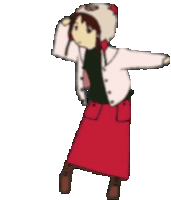

<h1 align="center">Hi  I'm Jesus Huayhua</h1>

I'm Jesus Huayhua a computer engineering student at [:school: PUCP college](https://www.pucp.edu.pe/)  Lima - Peru.

## Programming I languages

<picture>
<!-- <source media="(prefers-color-scheme: dark)" srcset="https://github-readme-stats-ouuan.vercel.app/api?username=ouuan&theme=dark&show_icons=true"> -->
    
</picture>

-   :desktop_computer: I know the following programming languages    
-   :atom_symbol: Operating system 
-   :hammer_and_wrench: IDE's  
-   :notebook_with_decorative_cover: Note taking app 
-   :book: I learn web development:   
-   :email:    
-   <picture> <source media="(prefers-color-scheme: dark)" srcset="https://raw.githubusercontent.com/danielcranney/readme-generator/main/public/icons/socials/github-dark.svg" /> <source media="(prefers-color-scheme: light)"/>  </picture>  College github 
    

## My Github's Stats

<table style=" margin-left: auto; margin-right: auto; border:none;" width="100%" height="100%" >
    <tr style="border: none;">
        <td style="border: none;"></td>
        <td style="border: none;"></td>
    </tr>
</table>

# My favorite anime's

    

    
    

