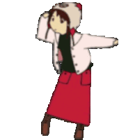

# Hi  I'm Jesus Huayhua

I'm Jesus Huayhua a computer engineering student at [:school: PUCP college](https://www.pucp.edu.pe/)  Lima - Peru.

    

        
Language Programming
            
            
            
            
        

        
I learn: 

        
Operating system: 

        
IDE's:
            <picture>
                
                
                
            </picture>
        

    

    

        
    

<table style=" margin-left: auto; margin-right: auto; border:none;" width="100%" height="100%" >
    <tr style="border: none;">
        <!--INFORMACION--->
        <td style="border: none;">
            
Language Programming
            
            
            
            
        

        
I learn: 

        
Operating system: 

        
IDE's:
            <picture>
                
                
                
            </picture>
        

        </td>
        <td style="border: none;">
            
        </td>
    </tr>
</table>